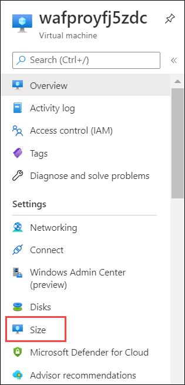
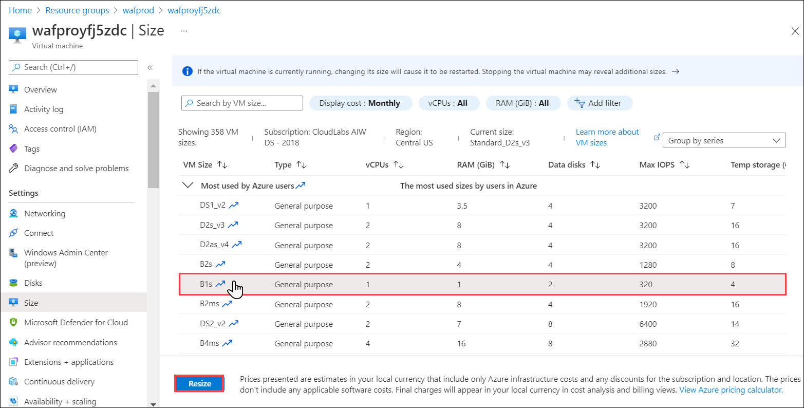
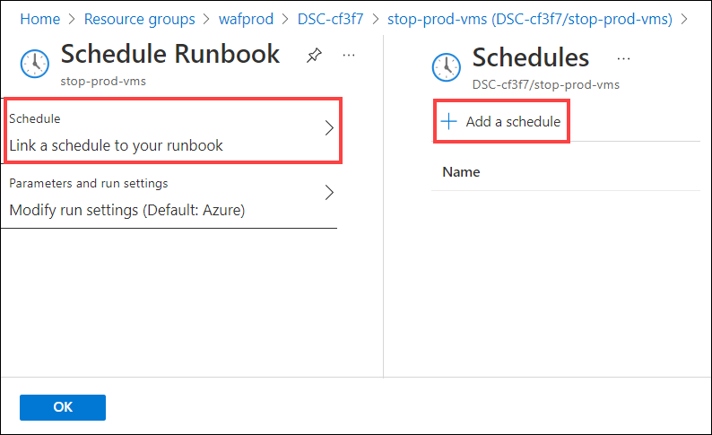
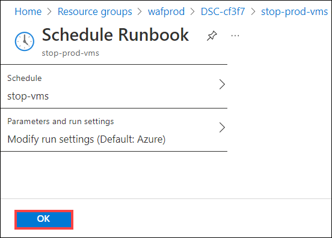
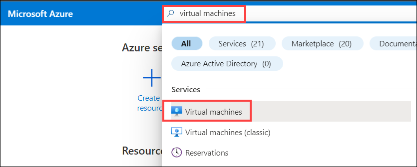
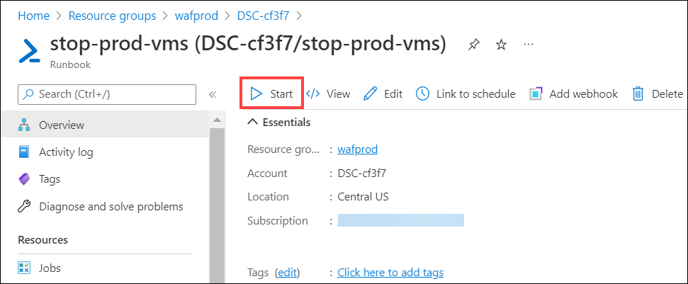

# Exercise 1: Cost Optimization

## Overview

Cost Optimization is the process of managing costs to maximize the value delivered. The **Cost Optimization** pillar provides principles for balancing business goals with budget justification to create a cost-effective workload while avoiding capital-intensive solutions. Cost optimization is about looking at ways to reduce unnecessary expenses and improve operational efficiencies.

The **Cost Optimization** in Well-Architected Assessment is a top-down review of your workload to identify what could be improved in your architecture. In this exercise, we will begin by looking at the costs of the workload as well as the most prevalent pain points and how to address them, such as:

  * Are there any hidden costs in the current architecture? How can you identify them?
  * Can the current IaaS architecture be more cost-effective? How?
  * How would you keep track of cloud expenditure?
  * What will be the cost impact of your new architecture recommendations?

This will help on the most immediate and direct impact of the recommendations.

**Task 1: Monitor and Forecast**

In this task you will learn how to monitor the cost of a workload with tools like Azure Advisor, Azure Cost Management and Billing.

**a. Azure Advisor:** It helps you optimize and reduce your overall Azure spend by identifying idle and underutilized resources. You can get cost recommendations from the Cost tab on the Advisor dashboard.


**Task 2: Resize a Virtual Machine**

You can lower cost by managing the size of the VMs. 

1. In the Azure portal, click on **Show portal menu (1)** and select **Resource groups(2)**.

   
   
2. Open **wafprod** resource group and select a vitrual machine.

   
   
3. Select **Size** present under _Settings_ pane.

   
   
4. From the list of available sizes, click on **B1s** size to select it and then click on **Resize** button.

   

 > **Note:** B-series burstable VMs are ideal for workloads that do not need the full performance of the CPU continuously, like web servers, small databases and development and test environments. TThe B-Series provides these customers the ability to purchase a VM size with a _**price conscious baseline performance**_ that allows the VM instance to build up credits when the VM is utilizing less than its base performance. When the VM has accumulated credit, the VM can burst above the VM’s baseline using up to 100% of the CPU when your application requires the higher CPU performance.

5. Go back to **Overview** page and verify the VM size. 

   


<p> &#11088; For a D2s_v3 which has 2 vCPUs and 8 GiB of memory the hourly rate is $0.227 per hour (monthly $163.83) and for B1s with 1 vCPU and 1 GiB memory the rate is $0.031 per hour (monthly $21.85). This results in savings! </p>


**Task 3: Shutdown**

Use the Start/stop VMs during off-hours feature of virtual machines to minimize waste. The feature is suitable as a **low-cost automation** option. There are many configuration options to schedule start the stop times. 

Some ways to Start/stop VMs are:
* From Azure portal, by going to each VM and start/stop it manually.
* Using PowerShell/CLI
* Enabling Autoshutdown for a VM
* Using Azure Automation

With respect to the workload we have, we will use Automation Accounts to perform the Start/Stop operation.

1. In the Azure portal, click on **Show portal menu (1)** and select **Resource groups(2)**.

   

2. Open **wafprod** resource group and open the Automation account **DSC-xxxx**.

   

3. In the left pane, scroll to _Process Automation_, select **Runbooks** and click on **+Create a runbook**.

   

 > **Good to know:** Microsoft Azure Automation service provides a framework to create and schedule workflows to simplify the repetitive and mundane tasks that Cloud administrators perform with Azure. The workflows are commonly known as **Runbooks**.

4. Fill the details as following:
 * Name: **stop-prod-vms (1)**
 * Runbook type: Select **PowerShell (2)** from the dropdown.
 * Runtime verion: **5.1 (3)**
 * Description: Give a description such as, **Stop the Virtual Machines present in WAF Prod resource group. (4)**
 * Click on **Create (5)**.

   
   
5. Once the runbook is created, it will look similar to the screenshot below. Now select **Edit** to add PowerShell script in the runbook.

   
   
6. Copy the script given below and paste in runbook console and then click on **Save**. 

```
$myCred = Get-AutomationPSCredential -Name '[Enter name of your credentials]'
$userName = $myCred.UserName
$securePassword = $myCred.Password
$password = $myCred.GetNetworkCredential().Password

$myPsCred = New-Object System.Management.Automation.PSCredential ($userName,$securePassword)

Connect-AzAccount -Credential $myPsCred
Set-AzContext -SubscriptionId "Enter your subscription id"

$ResourceGroupName = “Enter the resource group name”
Get-AzVM -ResourceGroupName $ResourceGroupName | Select Name | ForEach-Object {
Stop-AzVM -ResourceGroupName $ResourceGroupName -Name $_.Name
}

```
   
    
8. Go back to the automation account **DSC-xxxx** and from left pane scroll to _Shared Resources_. Select **Credentials** and then select **+Add a credential**. 

   
   
9. Fill following details:
 * Name: **user-credentials (1)**
 * Description: Give a description **(2)**
 * Username: **INJECTKEYS** **(3)**
 * Password: **(4)**
 * Confirm Password: **(5)**
 * Click on **Create (6)**.

   

10. From left pane, scroll to _Process Automation_ and select **Runbooks** and then select **stop-prod-vms**. 

   

11. On the Overview page, select **Edit**.

   

12. Fill in the following details:
 * Line 1: **user-credentials**
 * Line 9: **INJECTSUBSID**
 * Line 11: **wafprod**, this could be any resource group in which your VMs are present. In our workload VMs are present in wafprod resource group.
 * Click on **Publish**.

   

13. Select **Yes** when asked for Publish Runbook - Do you want to proceed.

   

14. Once done, select **Link to schedule** on the Overview page. This is to schedule the ...

   

15. Select **Schedule** then **+ Add a schedule**.

   

16. Fill in the details as following:
 * Name: **stop-vms**
 * Description: **stop all VMs in wafprod resource group**.
 * Starts: **Enter start time and date**.
 * Time zone: Select your time zone from the drop down.
 * Recurrence: Select **Recurring**.
 * Recur every: Enter the time period of recurrence.
 * Set expiration: Select **Yes**.
 * Expires: **Enter an expiry time and date for the runbook**.
 * Click on **Create**.

   
   
17. Click on **OK**.

   

18. Now search for virtual machines in the Azure portal and select **Virtual Machines**.

   

19. Notice that VMs from wafprod resource group are in running state.

   

20. Navigate back to the **stop-prod-vms** runbook and click on **Start**. Select **Yes** when asked - _Are you sure that you want to start the runbook?_

   

21. By clicking on Start button, it will take you to the Jobs page. In the **Output** section you can monitor the execution of the script. Keep on refreshing until it shows status of both the VMs as **succeeded**.

   

22. Go back to **Virtual Machines** and observe the status of both the machines present in wafprod resource group. It will show up as **Stopped(deallocated)**.

   

 > **Note:** Click on **Refresh** if the VMs don't reflect latest status.


