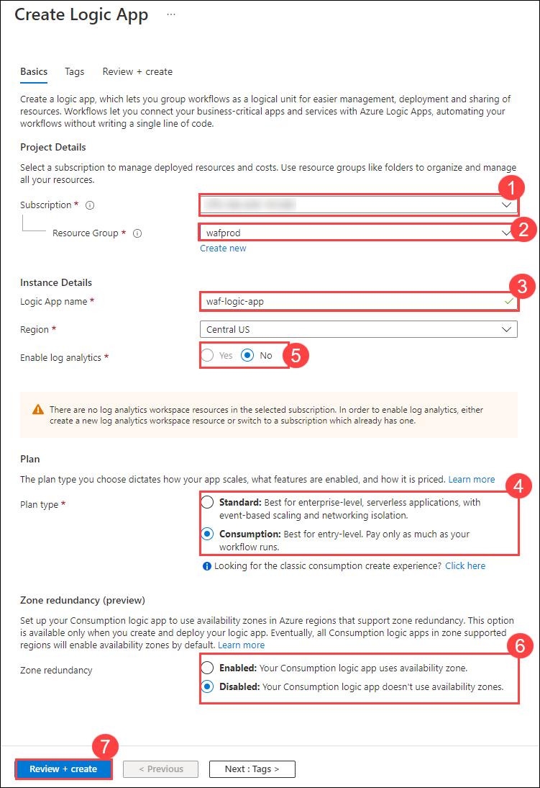
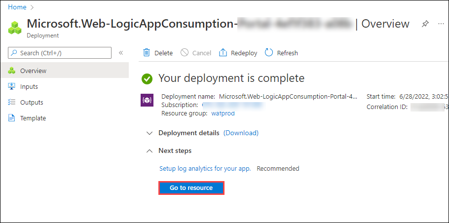
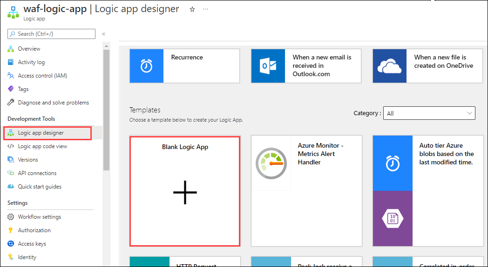
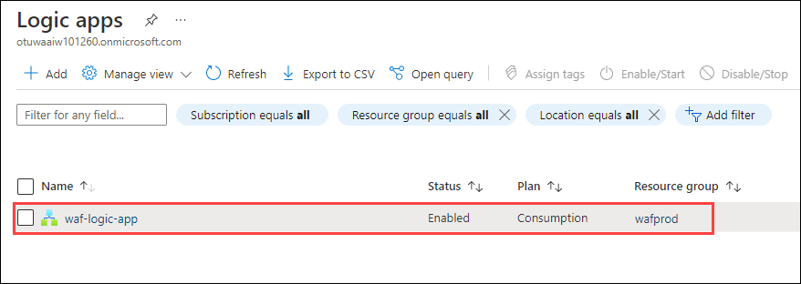
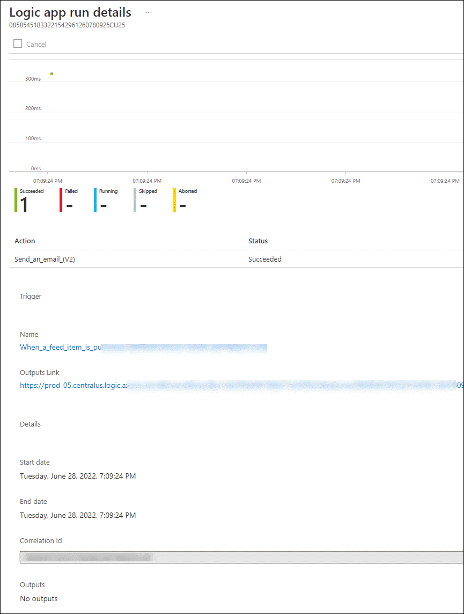

# Exercise 2: Operational-Excellence

## Overview

**Operational excellence** apply reliable, predictable, and automated operations processes to your architecture to keep an application running in production.

It covers the operations and processes that keep an application running in production. Deployments must be reliable and predictable. Automate deployments to reduce the chance of human error. Fast and routine deployment processes won't slow down the release of new features or bug fixes.

In this exercise, we will go through the given architecutre and know more about:

  * How would you optimize App time to market?
  * What would you automate? Does PaaS improve the operations?
  * Would you change anything in the current monitoring set up? Why?
  * What changes would you introduce in the deployment?.
  * Is the architecture prepared for the unexpected and to catch mistakes?

### Task 1: DevOps

 To activate resources on demand, deploy solutions rapidly, minimize human error, and produce consistent and repeatable results, we should automate deployments and updates.Complex issue may not always be able to be identified in a timely manner. However, with good automation, detection of these issues should occur quickly.

 Automation leads to more innovative solutions, and in general provides more value to the business. This in turn raises morale and job satisfaction.

 Once a process is automated, training and maintenance can be greatly reduced or eliminated. This frees engineers to spend less time on manual processes and more time on automating business solutions.

Thre differenet types of automation includes:

#### 1. Infrastructure deployment:

As businesses move to the cloud, they need to repeatedly deploy their solutions and know that their infrastructure is in a reliable state. To meet these challenges, you can automate deployments using a practice referred to as infrastructure as code. In code, you define the infrastructure that needs to be deployed.

-There are many deployment technologies you can use with Azure. Here are three examples that uses declarative approach:

 * Azure Resource Manager (ARM) templates
 * Azure Bicep
 * Terraform

#### 2. Infrastructure configuration

If you don't manage configuration carefully, your business could encounter disruptions such as systems outages and security issues. Optimal configuration can enable you to quickly detect and correct configurations that could interrupt or slow performance.

- When creating new resources on Azure, you may take advantage of configuration as code to bootstrap the deployment.

- Configuration tools can also be used to configure and manage the ongoing state of deployed resources.

#### 3. Operational tasks

As the demand for speed in performing operational tasks increases over time, you are expected to deliver things faster and faster. Manually performing operational tasks will fail to scale as demand increases. This is where automation can help. 

To meet on-demand delivery using an automation platform, you need to develop automation components (such as runbooks and configurations), create integrations to systems that are already in place efficiently, and operate and troubleshoot.

Advantages of automating operational tasks include:

 * Optimize and extend existing processes.
 * Deliver flexible and reliable services.
 * Lower costs.
 * Improve predictability.

### Task 2: Deployment

In this task you will be creating an automated workflow that integrates two services, an RSS feed for a website and an email account using logic app.

The RSS connector has a trigger that checks an RSS feed, based on a schedule. The Office 365 Outlook connector has an action that sends an email for each new item.

1. In the Azure search box, enter **logic apps (1)**, and select **Logic apps (2)**.

   
   
2. On the **Logic apps** page, select **Add**.

   
   
3. On the **Create Logic App** pane, on the Basics tab, provide the following basic information about your logic app:

   * **Subscription**: Select your default susbcription (1)
   * **Resource Group**: waf-prod (2)
   * **Logic App name**: waf-logic-app (3)
   * **Plan type**: Consumption (4)
   * **Enable log analytics**: No (5)
   * **Zone redundancy**: disbaled (6)
   * Leave all the other values as default and click on **Review + Create (7)** followed by **Create**.
    
   
   
4. After Azure successfully deploys your app, select **Go to resource**.

   
   
5. In the Logic App Designer, scroll through the page until you locate the **templates** section. Click on **Blank Logic App**.

   
   
6. In the designer search box, select **All** and enter **rss**. From the Triggers list, select the RSS trigger, **When a feed item is published**.
 
   
   
7. Provide the following information in the trigger details page:

    * **The RSS feed URL**: `https://feeds.a.dj.com/rss/RSSMarketsMain.xml` (1)
    * **Chosen property will be used to determine**: PublishDate (2)
    * **Interval**: 1 (3)
    * **Frequency**: Minute (4)
    * click on **New step (5)**

   
   
8. Enter `Send an email (V2)` in the filter box, then select the **Send an email (V2)** action for Office 365 Outlook.

   
   
9. Select **Sign in** and sign in to your Office 365 Outlook account.

   
   
10. In the Send an email form, provide the following values:

    * Enter your email address in the **To** box.
    * **Subject**: Enter **New RSS item:** and from the Add dynamic content list, under When a feed item is published, select **Feed title**.
    * **Body**: Enter **Date published:** and from the Add dynamic content list, under When a feed item is published, select **Feed published on**.

    

11. On the designer toolbar, select **Save** to save your logic app. .

    
    
12. Select **Run Trigger** to execute the Logic App. If the RSS feed has new items, your workflow sends an email for each new item. Otherwise, your workflow waits until the next interval to check the RSS feed again.

     
   
13. The following screenshot shows a sample email that's sent by the workflow.

    

### Task 3: Monitor 

1. In the Azure search box, enter **logic apps (1)**, and select **Logic apps (2)**.

   
   
2. Select your logic app with the name **waf-logic-app**. 

   
   
3. On your logic app's menu, select **Overview** and select **Trigger history**. Under **Trigger history**, all trigger attempts appear. Each time the trigger successfully fires, Azure Logic Apps creates an individual workflow instance and runs that instance.

   
   
4. To view information about a specific trigger attempt, select that trigger event.
  
5. You can now review information about the selected trigger event.

   
   
6. Go back to the logic app **Overview** pane and select **Runs history**. Under **Runs history**, you can see all the past, current, and any waiting runs appear.

   
   
7. To view information about a specific run, select that run. The **Logic app run** pane shows each step in the selected run, each step's run status, and the time taken for each step to run,

     
     
8. Click on **Run Details** and you will be able to view the run information in list form.

   
   
   
   
9. Go back to your logic app menu, under **Monitoring**, select **Alerts**.

   
   
   

### Task 4: Processes and cadence 
