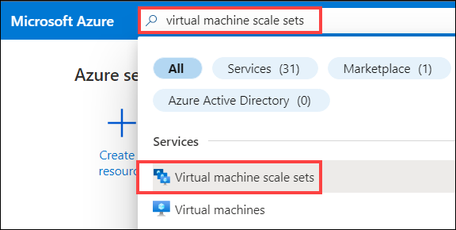
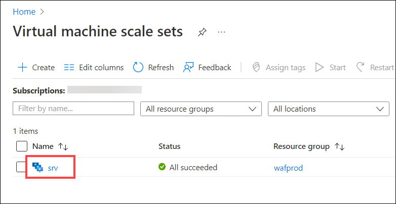
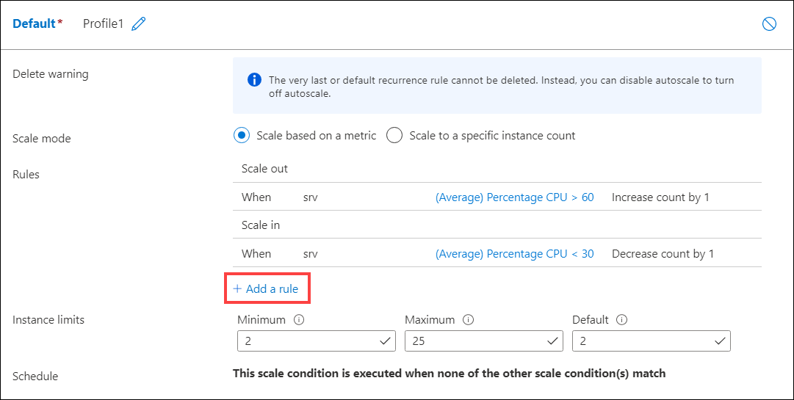
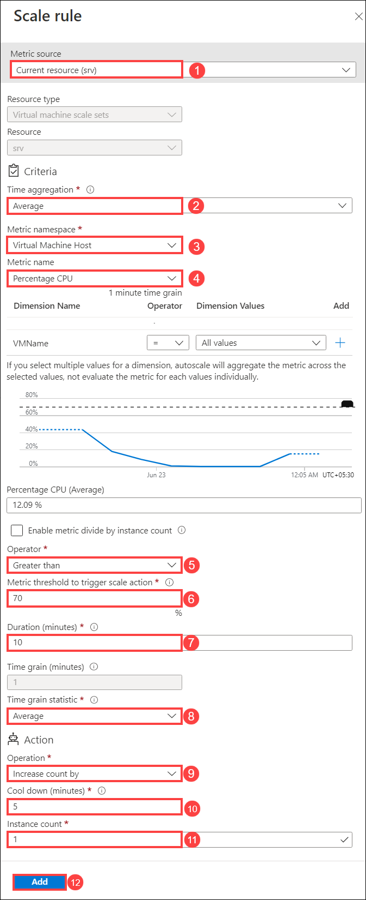
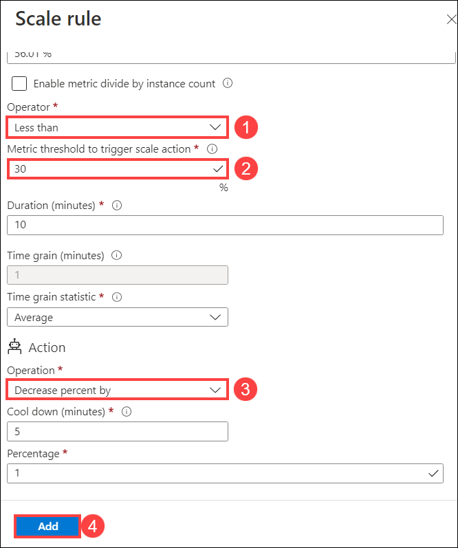
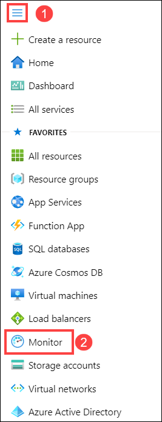

# Exercise 3: Performance-Efficiency

## Overview

Performance efficiency is the ability of your workload to scale to meet the demands placed on it by users in an efficient manner. Scaling correctly and using PaaS products with scaling built in are two of the most effective strategies to achieve performance efficiency.

In this exercise, we will go through the given architecutre and know more about:

* Can you provide a solution that scales to meet the public demand? How would this solution change in an PaaS architecture?
* How can you improve the performance visibility and alerting? Are all the tiers covered?
* Is there a more proactive approach?
* Is the architecture properly sized? Consider cost analysis to determine how much you can improve. 

### **Task1: Design for scaling** 

A system's scalability refers to its ability to manage increased load. Azure Autoscale-enabled services can scale automatically to meet demand and accommodate workload. These systems automatically scale out to maintain capacity during workload peaks and then return to normal once the peak has passed.

Vertical scaling and horizontal scaling are the two basic ways an application can scale. Vertical scaling (scaling up) enhances a resource's capacity, for example, by using a larger virtual machine (VM) size. Horizontal scaling (scaling out) refers to the addition of new instances of a resource, such as virtual machines or database replicas.

1. In the Azure portal, search for virtual machine scale sets and select **Virtual machine scale sets** from the suggestions.

   

2. Open the **srv** virtual machine scale set.

   

3. Choose **Scaling** from the menu on the left-hand side and then select the button to Custom autoscale.

   

4. Select the option to **Add a rule**.

   

5. Add the rule.....

   

6. Click on **Add a rule** again and fill in the following details:

-------

   

7. Set the following instance limits and select **Save**.

* **Minimum:** 1
* **Maximum:** 4
* **Default:** 2

   

8. To see the number and status of VM instances, select Instances from the menu on the left-hand side of the scale set window. The status indicates if the VM instance is Creating as the scale set automatically scales out, or is Deleting as the scale automatically scales in.

   

### **Task 2: Monitor performance **

