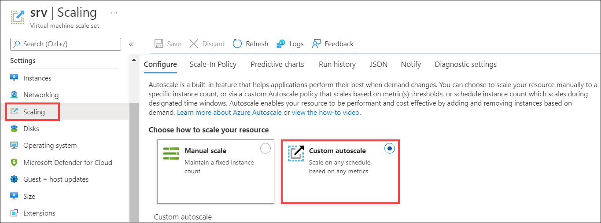
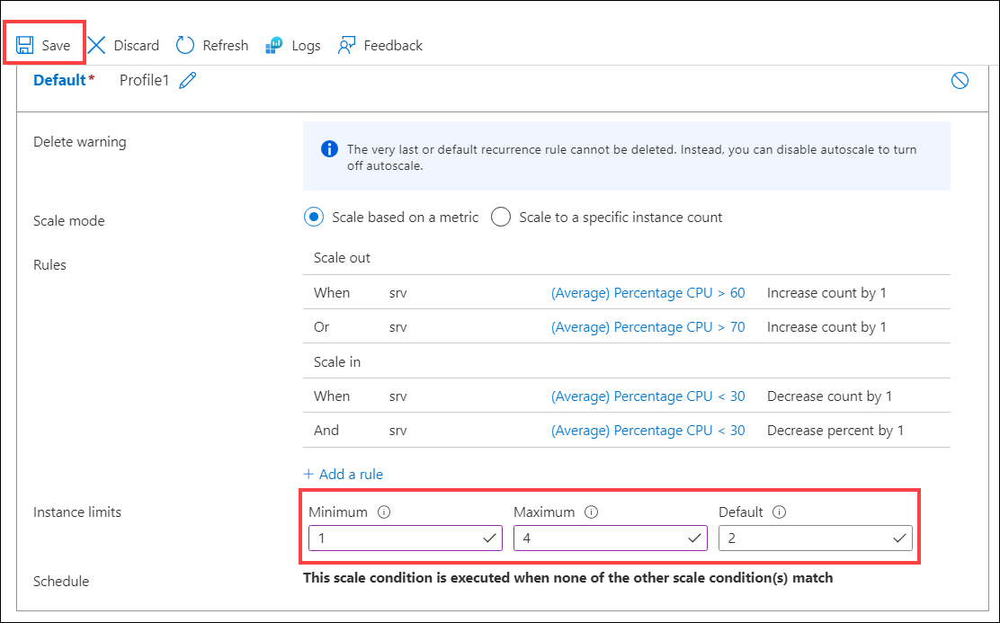
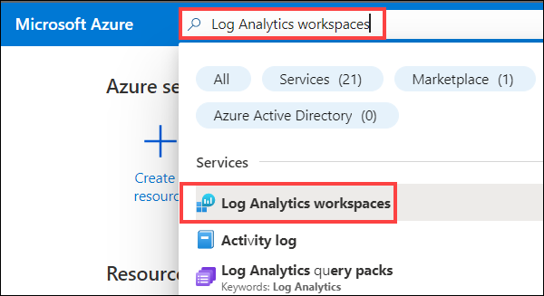
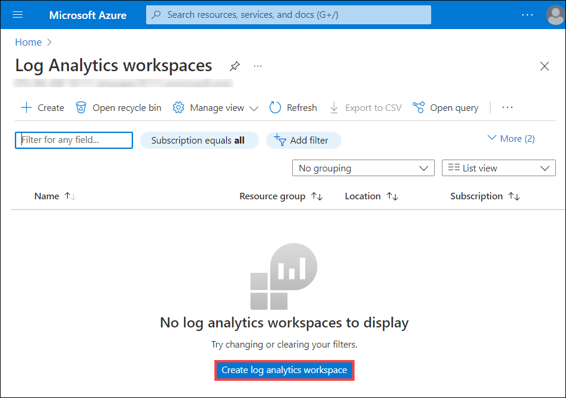
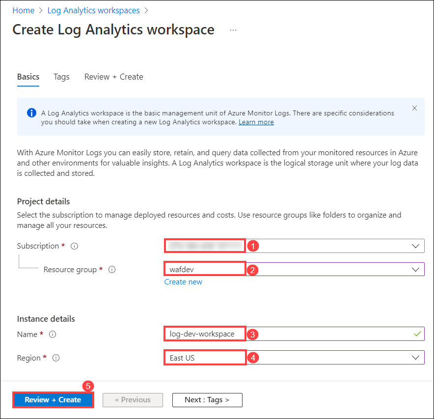
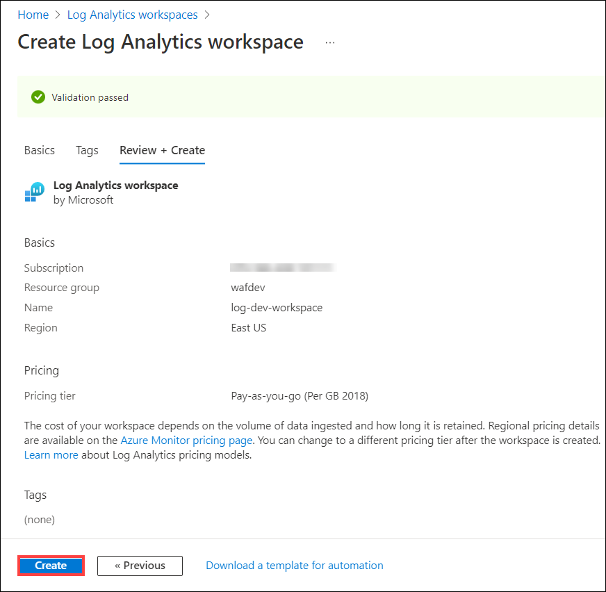
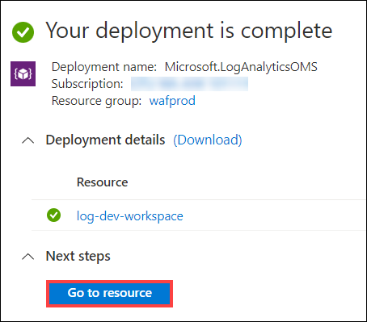
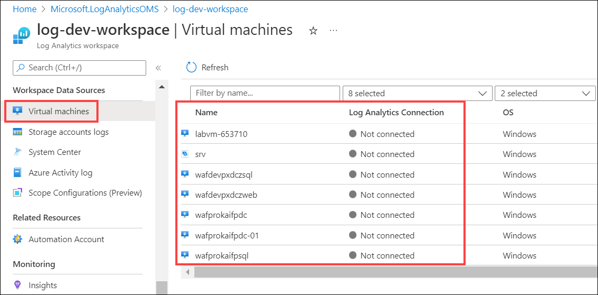
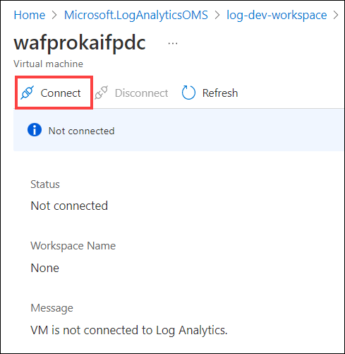
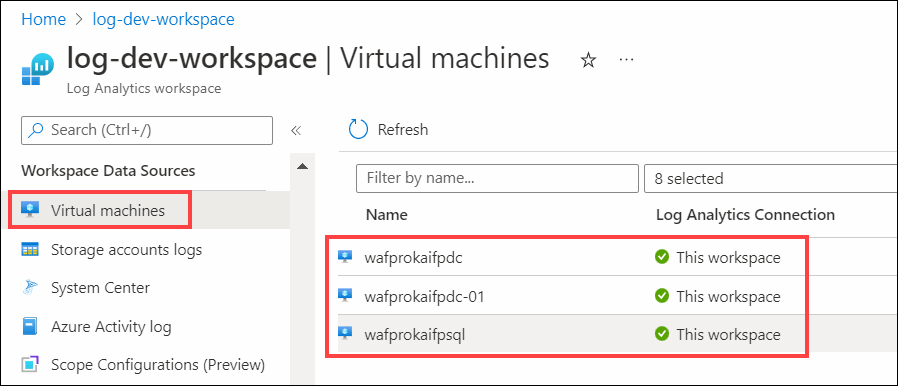

# Exercise 3: Performance-Efficiency

## Overview

Performance efficiency is the ability of your workload to scale to meet the demands placed on it by users in an efficient manner. Scaling correctly and using PaaS products with scaling built in are two of the most effective strategies to achieve performance efficiency.

In this exercise, we will go through the given architecutre and know more about:

* Can you provide a solution that scales to meet the public demand? How would this solution change in an PaaS architecture?
* How can you improve the performance visibility and alerting? Are all the tiers covered?
* Is there a more proactive approach?
* Is the architecture properly sized? Consider cost analysis to determine how much you can improve. 

### **Task1: Design for scaling** 

A system's scalability refers to its ability to manage increased load. Azure Autoscale-enabled services can scale automatically to meet demand and accommodate workload. These systems automatically scale out to maintain capacity during workload peaks and then return to normal once the peak has passed.

Vertical scaling and horizontal scaling are the two basic ways an application can scale. Vertical scaling (scaling up) enhances a resource's capacity, for example, by using a larger virtual machine (VM) size. Horizontal scaling (scaling out) refers to the addition of new instances of a resource, such as virtual machines or database replicas.

1. In the Azure portal, search for virtual machine scale sets and select **Virtual machine scale sets** from the suggestions.

   

2. Open the **srv** virtual machine scale set.

   

3. Choose **Scaling** from the menu on the left-hand side and then select the button to Custom autoscale.

   

4. Select the option to **Add a rule**.

   

5. Add the rule.....

   

6. Click on **Add a rule** again and fill in the following details:

-------

   

7. Set the following instance limits and select **Save**.

* **Minimum:** 1
* **Maximum:** 4
* **Default:** 2

   

8. To see the number and status of VM instances, select Instances from the menu on the left-hand side of the scale set window. The status indicates if the VM instance is Creating as the scale set automatically scales out, or is Deleting as the scale automatically scales in.

### **Task 2: Monitor performance**

In this task, we will use VM insights and monitor the performance and health of your virtual machines including their running processes and dependencies on other resources. By locating performance bottlenecks and network problems, it can assist in ensuring the availability of critical applications and delivering predictable performance. It can also assist in determining whether a problem is connected to other dependencies.

The fact that VM insights keeps its data in Azure Monitor Logs enables it to provide powerful aggregation and filtering as well as to track data trends over time. Let's begin the process by creating a log analytics workspace.

1. In the Azure portal, search for log analytics workspaces and select **Log analytics workspaces** from the suggestions.

   

2. Click on **Create log analytics workspace**.

   

3. Provide the project and instance details as follow:

* **Subscription:** Make sure your subscription is selected **by default (1)**.
* **Resource group:** Select a resource group from the drop down. Here we have selected **wafdev (2)**.
* **Name:** Give a name for the workspace **(3)**.
* **Region:** Select a region near to you, for example **EastUS (4)**.
* Click on **Review + Create**.

   

4. Review the details and click on **Create**.

   

5. Once the deployment succeeds, click on **Go to resource**.

   

6. From the left pane, select **Virtual machines (1)** present under _Workspace Data Sources_. Here you can see all the virtual machines and their status in respect to connectivity with the workpsace.

   

7. Now we will connect the VMs with the log analytics workspace. Here we will be working with the VMs that belong to **wafprod** resource group.

8. Click on **wafproxxxxx** virtual machine to open it and click on **Connect**. Follow the same process for other VMs from _wafprod_ resource group.

   

9. Return to the Virtual Machines tab from the menu in the left and observe the status of all three VMs. It should show up as **This workpsace** under _Log Analytics Connection_.

   

   > **Note:** In case the status is not updated, click on **Refresh** button to get the latest status.

10. 

   

