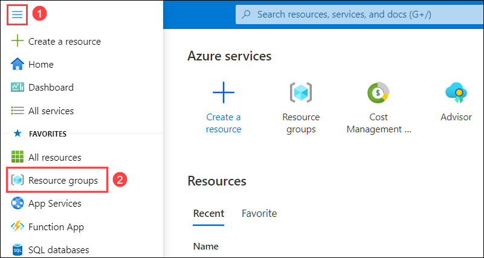
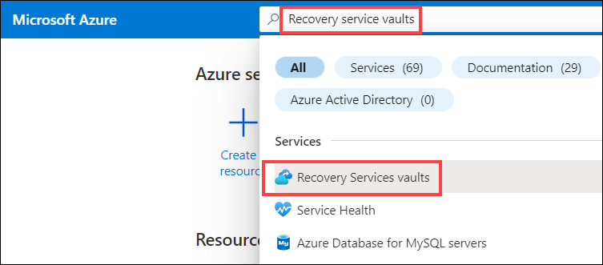

# Exercise 4: Reliability

## Overview

The term "reliable workload" refers to a task that is both resilient and available. The ability of a system to recover from failures and continue to function is known as resiliency. After a failure, the goal of resiliency is to restore the application to its original condition. The availability of your workload refers to whether or not your users can access it when they need it.

Building for reliability includes:
* Ensuring a highly available architecture
* Recovering from failures such as data loss, major downtime, or ransomware incidents

Azure has many resiliency features already built into the platform, such as:

* Azure Storage, SQL Database, and Cosmos DB all provide built-in data replication across availability zones and regions.
* Azure managed disks are automatically placed in different storage scale units to limit the effects of hardware failures.
* Virtual machines (VMs) in an availability set are spread across several fault domains. This limits the impact of physical hardware failures, network outages, or power interruptions.
* Availability Zones are physically separate locations within each Azure region. Each zone is composed of one or more datacenters equipped with independent power, cooling, and networking infrastructure. With availability zones, you can design and operate applications, and databases that automatically transition between zones without interruption, which ensures resiliency if one zone is affected.

### **Task 1: Define requirements** 

### **Task 2: Test with simulations and forced failovers** 

In this task, you will learn how to enable replication for virtual machines, run a test failover to validate your replication and disaster recovery strategy, without any data loss or downtime.

**### a. Replicate a Virtual machine**

1. In the Azure portal, click on **Show portal menu (1)** and select **Resource groups(2)**.

   

2. Open **wafprod** resource group and select a virtual machine.

   
   
3. From the left pane, select **Disaster recovery (1)** present under _Operations_. Then select a **Target region (2)** from the drop down and click on **Review + Start Replication (3)**.

   

4. Review the details and click on **Start replication**.

   

5. Once the deployment starts, a new resource group will get created in which a recovery service vault will get deployed.

6. In the search bar, search for Recovery service vaults and select **Recovery service vaults** from the suggestions.

   
   
7. Observe the vaults here, select the **Site-recovery-vault-eastus** vault, that falls under **site-recovery-vault-rg** resource group.

      

8. From the left pane, select **Site Recovery jobs** present under _Monitoring_. You will see all the jobs here with there status.

   

9. Now from the left pane, select **Replicated items** present under _Protected items_. You will have the the VM here that you just replicated, select that virtual machine **wafproxxxxxx**.

   

**### b. Run a test failover to Azure**

1. On the Overview page of the replicated virtual machine, you will have details such as _Health and status, Failover readiness, Errors_ and so on.

   

2. Now select **Test Failover**.

   

2. Select a Recovery Point to which to fail over. You can use one of the following options:

* Latest processed: This option fails over all VMs in the plan to the latest recovery point processed by Site Recovery. To see the latest recovery point for a specific VM, check Latest Recovery Points in the VM settings. This option provides a low RTO (Recovery Time Objective), because no time is spent processing unprocessed data.
* Latest app-consistent: This option fails over all the VMs in the plan to the latest application-consistent recovery point processed by Site Recovery. To see the latest recovery point for a specific VM, check Latest Recovery Points in the VM settings.
* Latest: This option first processes all the data that has been sent to Site Recovery service, to create a recovery point for each VM before failing over to it. This option provides the lowest RPO (Recovery Point Objective), because the VM created after failover will have all the data replicated to Site Recovery when the failover was triggered.
* Latest multi-VM processed: This option is available for recovery plans with one or more VMs that have multi-VM consistency enabled. VMs with the setting enabled fail over to the latest common multi-VM consistent recovery point. Other VMs fail over to the latest processed recovery point.
* Latest multi-VM app-consistent: This option is available for recovery plans with one or more VMs that have multi-VM consistency enabled. VMs that are part of a replication group fail over to the latest common multi-VM application-consistent recovery point. Other VMs fail over to their latest application-consistent recovery point.
* Custom: Use this option to fail over a specific VM to a particular recovery point.

3. Select an Azure virtual network in which test VMs will be created.

* Site Recovery attempts to create test VMs in a subnet with the same name and same IP address as that provided in the Compute and Network settings of the VM.
* If a subnet with the same name isn't available in the Azure virtual network used for test failover, then the test VM is created in the first subnet alphabetically.
* If same IP address isn't available in the subnet, then the VM receives another available IP address in the subnet. Learn more.
Track failover progress on the Jobs tab. You should be able to see the test replica machine in the Azure portal.

4. To initiate an RDP connection to the Azure VM, you need to add a public IP address on the network interface of the failed over VM. If you don't want to add a public IP address to the virtual machine, check the recommended alternatives here.

5. When everything is working as expected, click Cleanup test failover. This deletes the VMs that were created during test failover.

6. In Notes, record and save any observations associated with the test failover.

7. When a test failover is triggered, the following occurs:

* Prerequisites: A prerequisites check runs to make sure that all conditions required for failover are met.
* Failover: The failover processes and prepared the data, so that an Azure VM can be created from it.
* Latest: If you have chosen the latest recovery point, a recovery point is created from the data that's been sent to the service.
* Start: This step creates an Azure virtual machine using the data processed in the previous step.

### **Task 3: Deploy consistently** 

### **Task 4: Monitor health** 

### **Task 5: Respond to failure and disaster** 

