# Exercise 5: Security

## Overview

**Security** is one of the most important aspects of any architecture. It provides the **Confidentiality**, **Integrity**, **Availability** assurances against deliberate attacks and abuse of your valuable data and systems.

Losing these assurances can negatively affect your business operations and revenue, and your organization's reputation. Cloud architectures can help simplify the complex task of securing an enterprise estate through **specialization** and **shared responsibilities**:

 * **Specialization**: Specialist teams at cloud providers can develop advanced capabilities to operate and secure systems on behalf of organizations. This approach is preferable to numerous organizations individually developing deep expertise on managing and securing common elements.
 
 * **Shared Responsibility Model**: Organizations can reduce focus on activities that aren't core business competencies by shifting these responsibilities to a cloud service. Depending on the specific technology choices, some security protections will be built into the particular service, while addressing others will remain the customer's responsibility. To ensure that proper security controls are provided, organizations must carefully evaluate the services and technology choices.

In this exercise, we will apply security principles to your architecture to protect against attacks on the data and systems.

**Task 1: Identity and access management**

**Task 2: Infra protection**

In this task you will learn how to control access to the Azure resources that you deploy. you will also create a diagnostic setting to send the Activity log to Azure **Storage account** for cheaper, long-term archiving to get an insight into subscription-level events and to audit all the changes to the infrastructure.

**Role Assignment to Resources**

1. In the Azure Portal, navigate to the **Resource Group** named **wafdev**.

   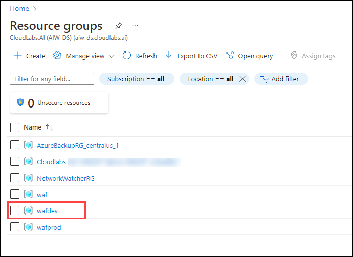
   
2. Select **Access Control (IAM)** in the left-hand menu, select **+ Add** above `Role assignments` and select **Add role assignment**.
   
   
   
3. In the add role assignment form, search for **Reader** in Role and select it, Click on Next.

   
   
4. In Members pane, for **Assign access to** select **User, group, or service principle** and for **Members** click on **+Select Members**.
   
   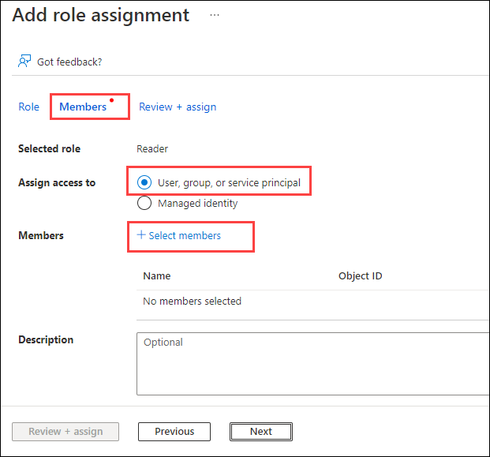
   
5. A Select members pane appears, search and add the member and **select**.
  
   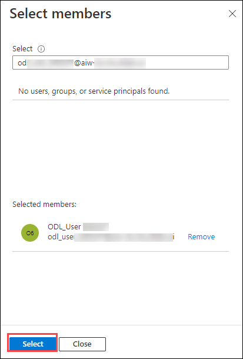
   
6. After adding the Member, then select **Review + Assign**.

   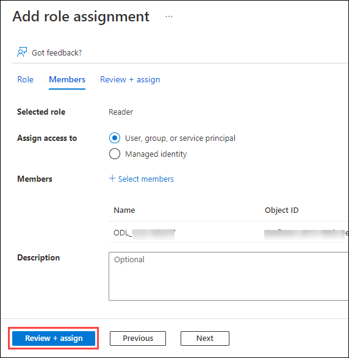
 
**Creating a Diagnostic Setting**
 
7. Navigate to the **wafdev** resource group pane and click on **Activity log**. 

   
   
8. Then from the filter menu, click on **Timespan** filter and then select **last month**. Click on **apply** to apply the filter.
   
   
   
9. Once the filter is applied and you are able to see all the operations from last month. Select **Export Activity Logs**.

   
   
10. On the **Diagnostic Settings** page, make your subscription is selected and then click on **+ Add diagnostic setting**.

    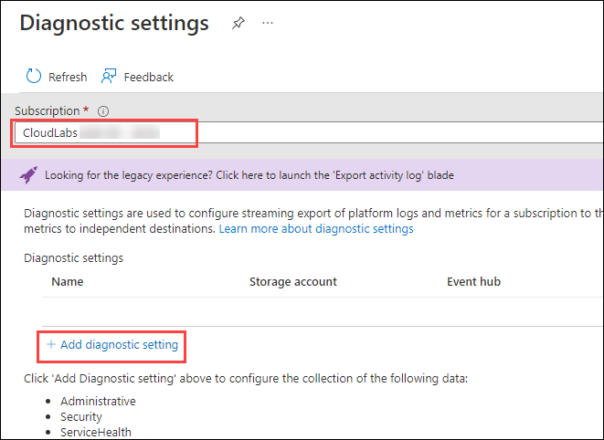
    
11. Make sure you fill the **Diagnostic Settings** page with the following details and click on **Save**.

    * **Diagnostic setting name**: `dev-log`
    *  **Logs**: Make sure you have selected all the categories
    *  **Destination details**: Check **Archive to a storage account** and leave all the other values to default

   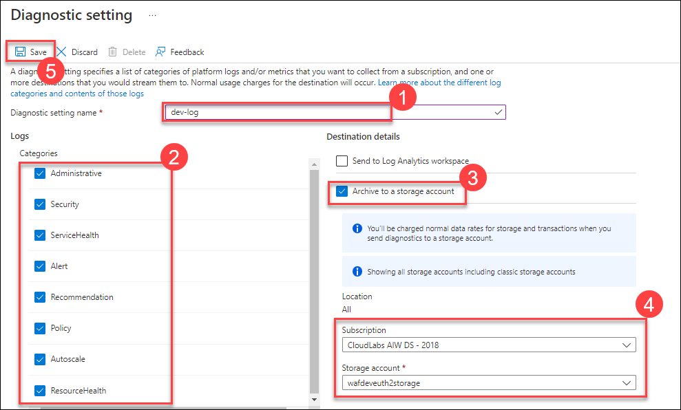
   
12. Navigate back to the **wafdev** resource group and select the storage account **wafdevxxxx**.

    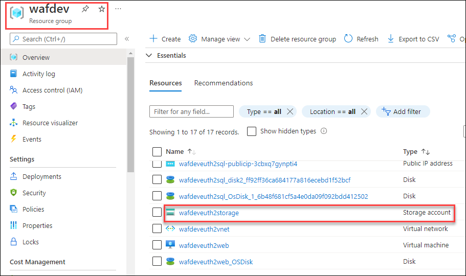
    
13. From the left navigation pane, under the **Data storage** section, Select **Containers**.

    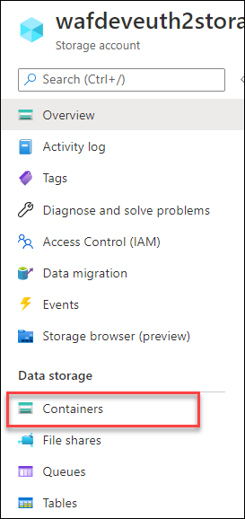
    
14. You will be able to see a container with the name **insights-activity-logs**. Click on it.

    
    
    
     > **Note:** The container might take upto 2 minutes for getting created. Click on **Refresh** button once in few seconds until you are able to see the container.
    
15. Go through the folder names **resourceid=** and observe that each event is stored in the PT1H.json file with the following format that uses a common top-level schema.

   `{ "time": "2020-06-12T13:07:46.766Z", "resourceId": "/SUBSCRIPTIONS/00000000-0000-0000-0000-000000000000/RESOURCEGROUPS/MY-RESOURCE-GROUP/PROVIDERS/MICROSOFT.COMPUTE/VIRTUALMACHINES/MV-VM-01", "correlationId": "0f0cb6b4-804b-4129-b893-70aeeb63997e", "operationName": "Microsoft.Resourcehealth/healthevent/Updated/action", "level": "Information", "resultType": "Updated", "category": "ResourceHealth", "properties": {"eventCategory":"ResourceHealth","eventProperties":{"title":"This virtual machine is starting as requested by an authorized user or process. It will be online shortly.","details":"VirtualMachineStartInitiatedByControlPlane","currentHealthStatus":"Unknown","previousHealthStatus":"Unknown","type":"Downtime","cause":"UserInitiated"}}}`
   
   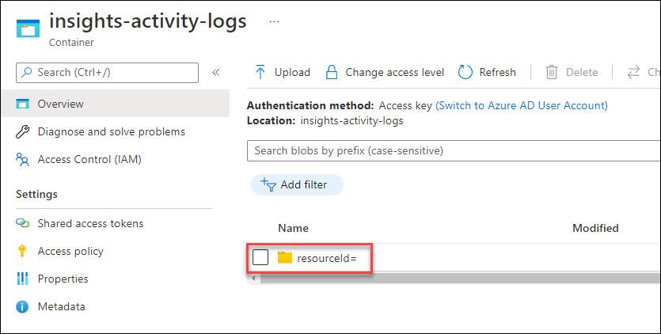

**Task 3: App Security**

**Task 4: Data encryption and sovereignty**

**Task 5: Security operations**

In this task, we are going to perform  integrated security monitoring for your workload using **Microsoft Defender for Cloud**. We will enable **Just-in-time** acccess to the Virtual machine which locks down and limits the ports of Azure virtual machine in order to overcome malicious attacks on the virtual machine, therefore only providing access to a port for a limited amount of time.

**Exploring Secure Score**

1. Type **Microsoft Defender** in the search box located on the top of the Azure Portal page and click on **Microsoft Defender for Cloud** to open it.

   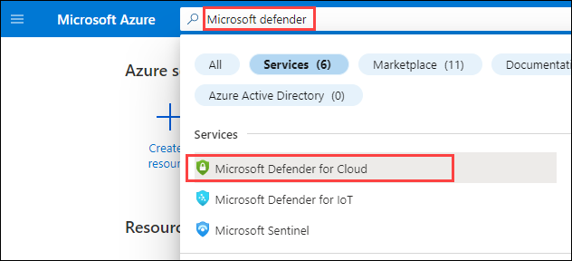
   
2. The Microsoft Defender for Cloud Overview page provides a unified view for security professionals. This page contains detailed insights on the security posture on its dedicated dashboard and includes multiple independent cloud security pillars such as- **Secure Score**, **Regulatory Compliance** and **Microsoft Defender for Cloud**.

   
   
3. On the **Overview** page, and look at the **Security posture** tile, you can see your current score along with the number of **Completed controls and Completed recommendations**. Clicking on this tile will redirect you to drill down view across subscriptions.

   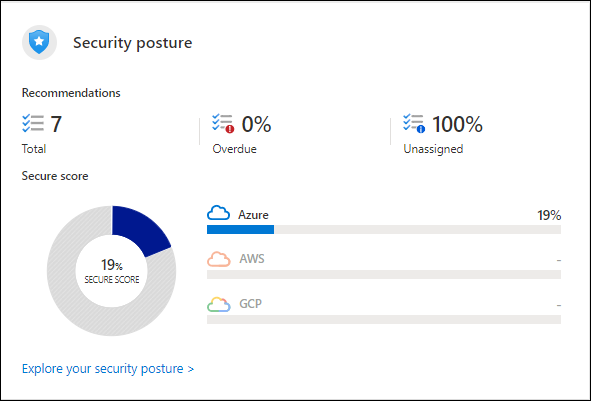
   
 > ⭐ Good to know:  
 > The higher the score, the lower the identified risk level.

4. The bottom section lists the subscriptions and their current secure scores. To view the recommendations behind the score, click on **View recommendations**.

   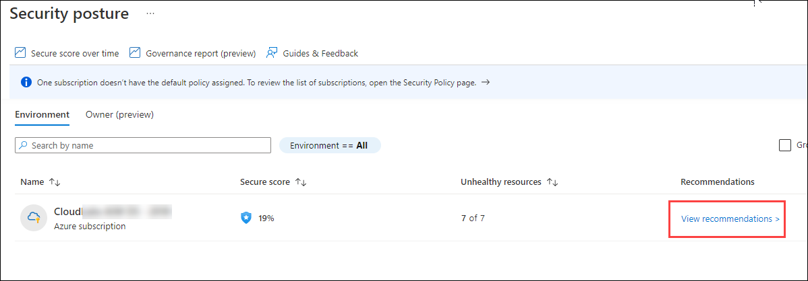
   
**Exploring Security Controls and Recommendations**
   
5. On the Recommendations page, pay attention to the first part of the page. It includes the current Secure Score, progress on the Recommendations status(both completed security controls and recommendations) and Resource health (by severity).

   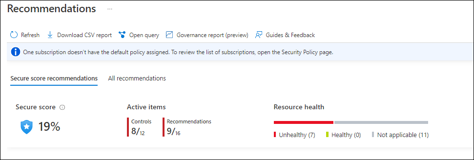
   
6. Under Recommendation, Click on **Secure management ports** and select **Management ports of virtual machines should be protected with just-in-time network access control**.

   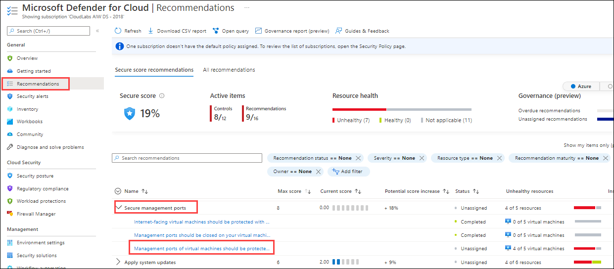
   
7. On the top section, notice the following:

   - Title of the recommendation: **Management ports of virtual machines should be protected with just-in-time network access control**
   - Top menu controls: **View policy definition** and **Open query**
   - Severity indicator: **High**
   - Freshness interval: **24 Hours** 
   - Tactics and techniques: **Initial Access**

   
   
8. The next important part is the Remediation Steps which contains the remediation logic where you can remediate the selected resource/s.

9. Under Affected resources, select the virtual machine with the name **wafdevXXX** on the Unhealthy resources and click on **Fix**. This will automatically apply the remediation on the selected resource.

   
  
10. This will open a new window - **Just-in-time VM access configuration**, review the implications for this remediation and click on **Save**.

   
   
11. Wait for a notification: ✅ **Just-in-time VM access enabled** - which successfully blocks all inbound traffic at the network level to the virtual machine **wafdevXXX**. 
    
    > **Note**: It can take upto 5 minutes for the VM access to get enabled. 

